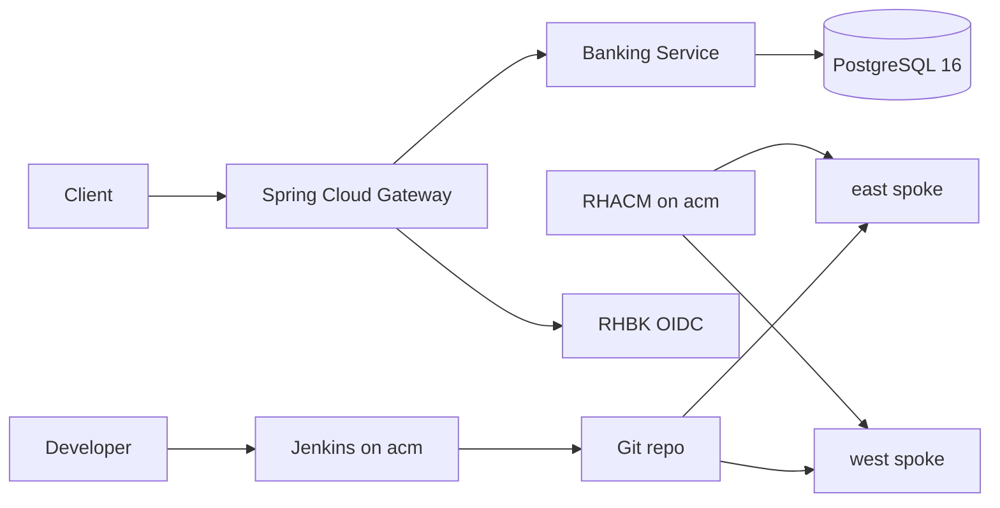

# Red Hat OpenShift Banking Demo

Demonstration of a banking Spring application on **OpenShift**, consuming **PostgreSQL 16** from the [Red Hat Ecosystem Catalog](https://catalog.redhat.com/en/software/containers/rhel10/postgresql-16/677d13af607921b4d74fca88), exposing APIs through **Spring Cloud Gateway**, and securing access with **OIDC JWT** via **Red Hat build of Keycloak**.

Multi-cluster layout: **acm** (RHACM, Conjur, Jenkins) places workloads to **east** / **west** via ApplicationSets. Spokes run OpenShift GitOps, ESO, OSSM 3.4 ambient, independent PostgreSQL + Keycloak, and the Spring apps. Mesh traffic can fail over; data and IdP do not.

> **Prep status:** manifests and docs are in-repo. Apply only when acm/east/west are ready — see [docs/multi-cluster.md](docs/multi-cluster.md).

## Architecture



| Layer | Red Hat / catalog component |
| --- | --- |
| Platform | Red Hat OpenShift |
| Multi-cluster | RHACM ApplicationSets / Placement |
| GitOps | OpenShift GitOps (Argo CD) |
| Mesh | OSSM 3.4 ambient (Sail / Istio ~1.30) |
| Secrets sync | External Secrets Operator for Red Hat OpenShift |
| Secrets backend | CyberArk Conjur OSS on acm |
| Identity | Red Hat build of Keycloak (per spoke) |
| Database | `registry.redhat.io/rhel10/postgresql-16` (per spoke) |
| CI | Jenkins on acm + BuildConfig |

## Repository layout

```text
apps/                      Spring Boot services
gitops/
  bootstrap/               acm-root, spoke-root, deprecated east root-app
  acm/                     Placement + ApplicationSets
  applications/{acm,east,west}/
  platform/                operators-hub / operators-spoke / eso-operand
  components/              conjur, mesh, apps, jenkins, postgresql, keycloak, …
ci/                        Jenkinsfiles + BuildConfigs
docs/                      English documentation
scripts/                   bootstrap-acm, conjur sync, mesh peering helpers
```

## Banking APIs (summary)

| Method | Path | Description |
| --- | --- | --- |
| `GET` | `/api/v1/customers` | List customers |
| `POST` | `/api/v1/customers` | Register customer |
| `GET` | `/api/v1/accounts` | List accounts |
| `POST` | `/api/v1/accounts` | Open account |
| `GET` | `/api/v1/accounts/{id}` | Account details |
| `GET` | `/api/v1/accounts/{id}/balance` | Account balance |
| `POST` | `/api/v1/transfers` | Fund transfer between accounts |
| `GET` | `/api/v1/transactions` | Transaction history |

All routes are exposed through the gateway and require a valid JWT from Keycloak (except actuator health).

## Quick start (multi-cluster)

1. Install RHACM + OpenShift GitOps on **acm**; join east/west.
2. `scripts/bootstrap-acm.sh` then `oc apply -k gitops/acm` (after labeling ManagedClusters).
3. Replace Conjur / Keycloak domain placeholders; sync Conjur creds to spokes.
4. Exchange mesh remote secrets; obtain a token from a spoke Keycloak and call that spoke’s gateway.

See [docs/multi-cluster.md](docs/multi-cluster.md) and [docs/getting-started.md](docs/getting-started.md).

## Documentation

- [Architecture](docs/architecture.md)
- [Multi-cluster](docs/multi-cluster.md)
- [Getting started](docs/getting-started.md)
- [Secrets management](docs/secrets-management.md)
- [CI/CD](docs/ci-cd.md)
- [API reference](docs/api-reference.md)

## License

Demo / sample code for Red Hat OpenShift workshops.
