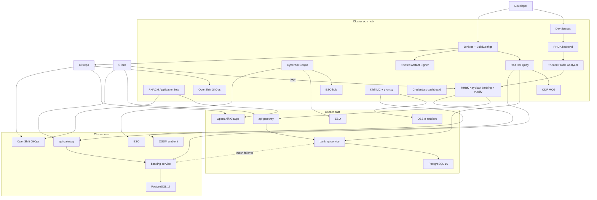

# Red Hat OpenShift Banking Demo

Demonstration of a banking Spring application on **OpenShift**, consuming **PostgreSQL 16** from the [Red Hat Ecosystem Catalog](https://catalog.redhat.com/en/software/containers/rhel10/postgresql-16/677d13af607921b4d74fca88), exposing APIs through **Spring Cloud Gateway**, and securing access with **OIDC JWT** via **Red Hat build of Keycloak**.

Multi-cluster layout: **acm** (RHACM hub — Conjur, Jenkins, ODF, Quay, Trusted Artifact Signer, Trusted Profile Analyzer) manages **east** / **west** as regional managed clusters via ApplicationSets. East/west run OpenShift GitOps, ESO, OSSM 3.4 ambient, independent PostgreSQL, and the Spring apps. Mesh traffic can fail over; data does not.

> **Install:** join acm/east/west, then run the Ansible installer — see [ansible/README.md](ansible/README.md) and [docs/multi-cluster.md](docs/multi-cluster.md).

## Architecture



| Layer | Red Hat / catalog component |
| --- | --- |
| Platform | Red Hat OpenShift |
| Multi-cluster | RHACM ApplicationSets / Placement |
| GitOps | OpenShift GitOps (Argo CD) |
| Mesh | OSSM 3.4 ambient (Sail / Istio ~1.30) |
| Secrets sync | External Secrets Operator for Red Hat OpenShift |
| Secrets backend | CyberArk Conjur OSS on acm |
| Identity | Red Hat build of Keycloak (hub realms `banking` + `trustify`) |
| Database | `registry.redhat.io/rhel10/postgresql-16` (per cluster) |
| Object storage | OpenShift Data Foundation (MCG) on acm |
| Registry | Red Hat Quay on acm |
| Signing | Red Hat Trusted Artifact Signer (Securesign) |
| SCA / SBOM analytics | Red Hat Trusted Profile Analyzer + RHDA |
| Inner loop | OpenShift Dev Spaces (acm) |
| CI | Jenkins on acm + BuildConfig → Quay sign/attest |

## Repository layout

```text
apps/                      Spring Boot services
.devfile / .vscode         Dev Spaces Spring + Dependency Analytics
gitops/
  bootstrap/               acm-root, managed cluster root
  acm/                     Placement + ApplicationSets
  applications/{acm,east,west}/
  platform/                operators-hub / operators-managed / eso-operand
  components/              conjur, mesh, apps, jenkins, quay, odf, rhtas, tpa, …
ci/                        Jenkinsfiles, BuildConfigs, sign-and-attest.sh
docs/                      English documentation
scripts/                   bootstrap-acm, conjur sync, mesh, banners
```

## Banking APIs (summary)

| Method | Path | Description |
| --- | --- | --- |
| `GET` | `/api/v1/customers` | List customers |
| `POST` | `/api/v1/customers` | Register customer |
| `GET` | `/api/v1/accounts` | List accounts |
| `POST` | `/api/v1/accounts` | Open account |
| `GET` | `/api/v1/accounts/{id}` | Account details |
| `GET` | `/api/v1/accounts/{id}/balance` | Account balance |
| `POST` | `/api/v1/transfers` | Fund transfer between accounts |
| `GET` | `/api/v1/transactions` | Transaction history |

All routes are exposed through the gateway and require a valid JWT from Keycloak (except actuator health).

## Quick start (multi-cluster)

1. Install RHACM on **acm**; join east/west as Available ManagedClusters; configure `oc` contexts.
2. Copy `ansible/inventory.example.yml` → `inventory.yml` (set `git_repo_url` / `git_target_revision` to a per-environment branch or fork).
3. `cd ansible && ansible-playbook -i inventory.yml playbooks/install.yml`  
   Use `-e auto_push_env=true` if Argo must read the rewritten env hosts from Git.
4. Optional: `scripts/bootstrap-gitea.sh`, `scripts/apply-console-banners.sh`, `scripts/apply-console-links.sh`.
5. Open the hub credentials dashboard Route in `namespace/dashboard`, get a JWT from hub Keycloak realm `banking`, call either cluster gateway.

See [ansible/README.md](ansible/README.md), [docs/multi-cluster.md](docs/multi-cluster.md), and [docs/getting-started.md](docs/getting-started.md).

## Documentation

- [Architecture](docs/architecture.md)
- [Multi-cluster](docs/multi-cluster.md)
- [Ansible installer](ansible/README.md)
- [Supply chain (ODF, Quay, RHTAS, TPA, Dev Spaces)](docs/supply-chain.md)
- [Getting started](docs/getting-started.md)
- [Secrets management](docs/secrets-management.md)
- [CI/CD](docs/ci-cd.md)
- [Conjur PAT + secret sync demo](docs/conjur-pat-and-sync.md)
- [API reference](docs/api-reference.md)

## License

Demo / sample code for Red Hat OpenShift workshops.
