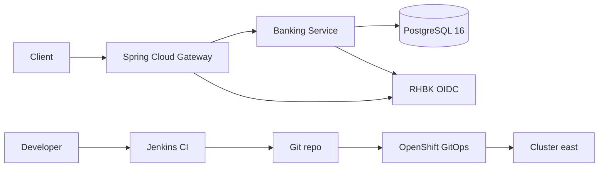

# Red Hat OpenShift Banking Demo

Demonstration of a banking Spring application on **OpenShift**, consuming **PostgreSQL 16** from the [Red Hat Ecosystem Catalog](https://catalog.redhat.com/en/software/containers/rhel10/postgresql-16/677d13af607921b4d74fca88), exposing APIs through **Spring Cloud Gateway**, and securing access with **OIDC JWT** via **Red Hat build of Keycloak**.

Deployment and operators are managed with **OpenShift GitOps** (app-of-apps). Secrets are stored in **CyberArk Conjur** and synced with the **External Secrets Operator for Red Hat OpenShift** (apps never call Conjur directly). CI uses **Jenkins** (Helm) and OpenShift **BuildConfig** pipelines. GitOps synchronizes the desired state to the cluster.

> **Scope (current):** single cluster — **east**. Multi-cluster (west + ACM) will be added later.

## Architecture



| Layer | Red Hat / catalog component |
| --- | --- |
| Platform | Red Hat OpenShift |
| GitOps | OpenShift GitOps (Argo CD) |
| Secrets sync | External Secrets Operator for Red Hat OpenShift |
| Secrets backend | CyberArk Conjur OSS (Helm, GitOps-managed) |
| Identity | Red Hat build of Keycloak (RHBK) |
| Database | `registry.redhat.io/rhel10/postgresql-16` |
| Runtime images | UBI / OpenJDK from Red Hat registries |
| CI | OpenShift Jenkins (Helm) + BuildConfig |

## Repository layout

```text
apps/
  banking-service/     Spring Boot banking REST API
  api-gateway/         Spring Cloud Gateway (OIDC resource server / JWT)
gitops/
  bootstrap/           Root Application (app-of-apps)
  applications/        Argo CD Application CRs
  platform/            Operator subscriptions (GitOps, RHBK, ESO) + ESO operand
  components/          Conjur, ExternalSecrets, apps, Jenkins, PostgreSQL, Keycloak
ci/
  Jenkinsfile          Pipeline: clone → Maven build → tests → GitOps update
  buildconfig/         OpenShift BuildConfig (JenkinsPipeline strategy)
docs/                  English documentation
scripts/               Bootstrap helpers for cluster east
```

## Banking APIs (summary)

| Method | Path | Description |
| --- | --- | --- |
| `GET` | `/api/v1/customers` | List customers |
| `POST` | `/api/v1/customers` | Register customer |
| `GET` | `/api/v1/accounts` | List accounts |
| `POST` | `/api/v1/accounts` | Open account |
| `GET` | `/api/v1/accounts/{id}` | Account details |
| `GET` | `/api/v1/accounts/{id}/balance` | Account balance |
| `POST` | `/api/v1/transfers` | Fund transfer between accounts |
| `GET` | `/api/v1/transactions` | Transaction history |

All routes are exposed through the gateway and require a valid JWT from Keycloak (except actuator health).

## Quick start

1. Install OpenShift GitOps on cluster **east** (OperatorHub or `scripts/bootstrap-east.sh`).
2. Set `GIT_REPO_URL` and cluster domain in `gitops/` overlays.
3. Apply the root app:

```bash
oc apply -f gitops/bootstrap/root-app.yaml -n openshift-gitops
```

4. Argo CD syncs operators → Conjur → External Secrets → apps (PostgreSQL, Keycloak, Jenkins, gateway, banking-service).
5. Obtain a token from Keycloak and call the gateway.

See [docs/getting-started.md](docs/getting-started.md) and [docs/secrets-management.md](docs/secrets-management.md).

## Prerequisites

- OpenShift 4.14+ (east)
- `oc` CLI logged into east
- Git repository hosting this project (HTTPS or SSH for Argo CD and Jenkins)
- Pull secret with access to `registry.redhat.io` for PostgreSQL and UBI images

## Documentation

- [Architecture](docs/architecture.md)
- [Getting started](docs/getting-started.md)
- [Secrets management](docs/secrets-management.md)
- [CI/CD](docs/ci-cd.md)
- [API reference](docs/api-reference.md)

## License

Demo / sample code for Red Hat OpenShift workshops.
