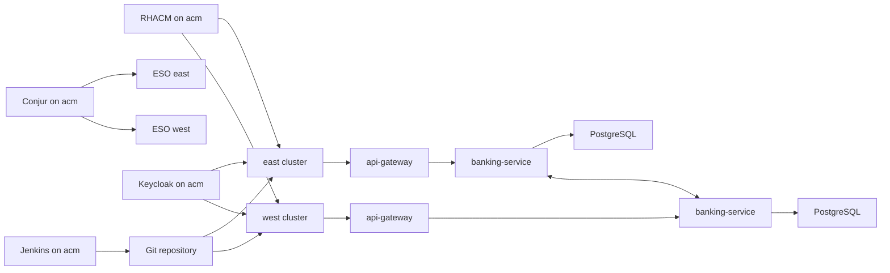

# Architecture

## Overview

This demo targets three OpenShift clusters:

| Cluster | Role |
| --- | --- |
| **acm** | RHACM hub, Conjur, Jenkins, ODF, Quay, RHTAS, TPA, hub Kiali |
| **east** / **west** | Managed clusters with GitOps, ESO, OSSM 3.4 ambient, PostgreSQL, Spring apps |

Credentials are sourced from **CyberArk Conjur** on the hub via the **External Secrets Operator** on each cluster. Spring apps never talk to Conjur; they only mount Kubernetes Secrets that ESO materializes.

**Traffic failover ≠ data failover.** Mesh locality can send `banking-service` traffic to the peer cluster; each cluster keeps its own PostgreSQL.

**OIDC is centralized on the hub.** A single Keycloak instance on **acm** provides:

- Realm `banking` for Spring apps
- Realm `trustify` for TPA

## Red Hat / catalog components

| Concern | Component |
| --- | --- |
| Container platform | Red Hat OpenShift |
| Multi-cluster | Red Hat Advanced Cluster Management (RHACM) |
| GitOps | OpenShift GitOps Operator (Argo CD) |
| Service mesh | OpenShift Service Mesh 3.4 (Sail, ambient, Istio ~1.30) |
| Secrets sync | External Secrets Operator for Red Hat OpenShift |
| Secrets backend | CyberArk Conjur OSS (Helm chart, GitOps Application on acm) |
| Identity (OIDC) | Red Hat build of Keycloak (`rhbk-operator`) — **hub (acm)** |
| Banking DB | [`registry.redhat.io/rhel10/postgresql-16`](https://catalog.redhat.com/en/software/containers/rhel10/postgresql-16/677d13af607921b4d74fca88) — **per cluster** |
| App runtime images | UBI 9 OpenJDK 21 |
| Object storage | OpenShift Data Foundation (Multicloud Object Gateway) on acm |
| Container registry | Red Hat Quay on acm (SBOM, signature, attestation) |
| Artifact signing | Red Hat Trusted Artifact Signer (Securesign) |
| Dependency analytics | Red Hat Trusted Profile Analyzer + RHDA backend |
| Developer workspaces | OpenShift Dev Spaces on **acm** |
| CI | Jenkins on acm + OpenShift BuildConfig → Quay sign/attest |

## GitOps ownership

1. **acm:** [`gitops/bootstrap/acm-root.yaml`](../gitops/bootstrap/acm-root.yaml) → [`gitops/applications/acm`](../gitops/applications/acm) (Conjur, Keycloak, Jenkins, ODF, Quay, RHTAS, TPA, Dev Spaces, hub ESO, Kiali, promxy, CI BuildConfigs).
2. **RHACM:** [`gitops/acm`](../gitops/acm) Placement + ApplicationSet generates Applications that sync `gitops/applications/{{east|west}}` to each ManagedCluster.
3. **Managed cluster waves (east/west):**
  - `0` platform operators (ESO, Sail, GitOps)
   - `1` ESO operand
   - `2` mesh (Istio / CNI / ZTunnel / east-west GW / DestinationRule)
   - `3` `ClusterSecretStore` + app `ExternalSecret`s (Conjur URL → acm)
  - `4+` PostgreSQL, banking-service, api-gateway

Details: [secrets-management.md](secrets-management.md), [multi-cluster.md](multi-cluster.md).

## Security model

- Clients obtain an access token from the **hub** Keycloak realm `banking`.
- **api-gateway** validates the JWT (`issuer-uri`) and proxies `/api/**` to **banking-service**.
- **banking-service** is also an OAuth2 resource server.
- Actuator health endpoints remain unauthenticated for probes.
- Database and admin passwords are not stored in Git; Conjur on acm is the source of truth.

## Mesh failover

- `banking-service` Service: `istio.io/global=true` + waypoint
- DestinationRule: `outlierDetection` + `localityLbSetting.failoverPriority: topology.istio.io/cluster`
- PostgreSQL Services stay local (no global label); Keycloak is hub-only

See [multi-cluster.md](multi-cluster.md) for the scale-to-zero demo.
