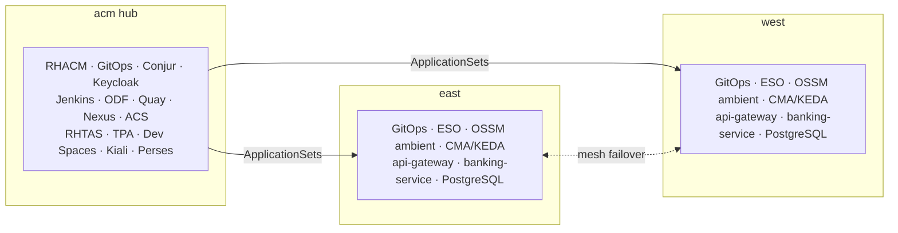
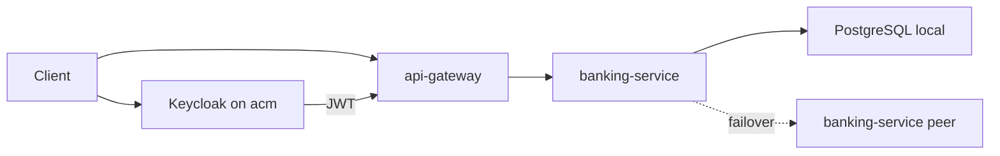
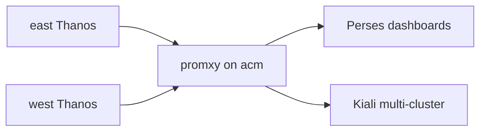
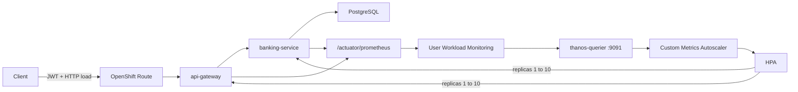
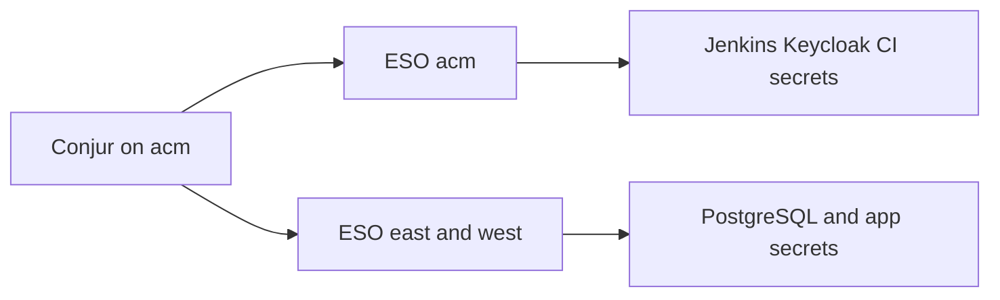
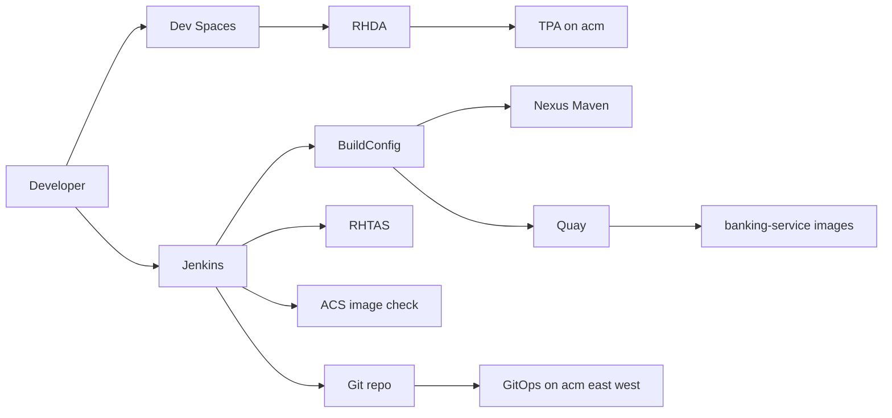

# Architecture

## Overview

This demo targets three OpenShift clusters:

| Cluster | Role |
| --- | --- |
| **acm** | RHACM hub, Conjur, Keycloak, Jenkins, ODF, Quay, Nexus, RHTAS, TPA, ACS, Dev Spaces, Kiali/promxy/Perses |
| **east** / **west** | Managed clusters with GitOps, ESO, OSSM 3.4 ambient, CMA (KEDA), PostgreSQL, Spring apps |

Credentials are sourced from **CyberArk Conjur** on the hub via the **External Secrets Operator** on each cluster. Spring apps never talk to Conjur; they only mount Kubernetes Secrets that ESO materializes.

**Traffic failover ≠ data failover.** Mesh locality can send `banking-service` traffic to the peer cluster; each cluster keeps its own PostgreSQL.

Mesh failover demo (scale backend → 0, ambient serves peer): [mesh-failover.md](mesh-failover.md).  
A parallel path uses **Service Interconnect** in `banking-si-*` namespaces: [service-interconnect-failover.md](service-interconnect-failover.md).  
Hub metrics UI: [observability-perses.md](observability-perses.md) (Perses + promxy).

**OIDC is centralized on the hub.** A single Keycloak instance on **acm** provides:

- Realm `banking` for Spring apps
- Realm `trustify` for TPA

### Where things run

### Runtime request path

PostgreSQL stays local to each managed cluster. Mesh can shift `banking-service` traffic east ↔ west; data does not follow. Live storyboard: [mesh-failover.md](mesh-failover.md).

### Observability (Perses + promxy)

| UI | Cluster | Purpose |
| --- | --- | --- |
| Kiali + OSSMC | acm | Ambient mesh graph (`banking-apps`) |
| Perses (Observe → Dashboards) | acm | **Banking HTTP** · **Banking failover compare** |
| Network Observer | west | SI topology (`banking-si-apps`) |

Detail: [observability-perses.md](observability-perses.md).

### Autoscaling (CMA / KEDA)

On each spoke, Custom Metrics Autoscaler scales mesh and SI Spring Deployments (1→~10) from CPU and Prometheus HTTP RPS. Load is required to see scale-out.

Detail and demo commands: [keda-autoscaling.md](keda-autoscaling.md).

### Secrets

### Supply chain

## Red Hat / catalog components

| Concern | Component |
| --- | --- |
| Container platform | Red Hat OpenShift |
| Multi-cluster | Red Hat Advanced Cluster Management (RHACM) |
| GitOps | OpenShift GitOps Operator (Argo CD) |
| Service mesh | OpenShift Service Mesh 3.4 (Sail, ambient, Istio ~1.30) |
| App interconnect (parallel demo) | Red Hat Service Interconnect 2.x + Network Observer |
| Ingress (mesh + SI demos) | OpenShift Routes on east / west (`api-gateway`) |
| Secrets sync | External Secrets Operator for Red Hat OpenShift |
| Secrets backend | CyberArk Conjur OSS (Helm chart, GitOps Application on acm) |
| Identity (OIDC) | Red Hat build of Keycloak (`rhbk-operator`) — **hub (acm)** |
| Banking DB | [`registry.redhat.io/rhel10/postgresql-16`](https://catalog.redhat.com/en/software/containers/rhel10/postgresql-16/677d13af607921b4d74fca88) — **per cluster** |
| App runtime images | UBI 9 OpenJDK 21 |
| Object storage | OpenShift Data Foundation (Multicloud Object Gateway) on acm |
| Container registry | Red Hat Quay on acm (SBOM, signature, attestation) |
| Maven repository | Nexus on acm (`maven-public` = Central + Red Hat GA) |
| Image policy | RHACS on acm (`roxctl image check` in Jenkins) |
| Artifact signing | Red Hat Trusted Artifact Signer (Securesign) |
| Dependency analytics | Red Hat Trusted Profile Analyzer + RHDA backend |
| Developer workspaces | OpenShift Dev Spaces on **acm** |
| CI | Jenkins → Nexus → BuildConfig → Quay/RHTAS → ACS → GitOps |
| CI | Jenkins on acm + OpenShift BuildConfig → Quay sign/attest |
| Autoscaling | Custom Metrics Autoscaler Operator (CMA / KEDA) on east / west — CPU + Prometheus HTTP RPS, max 10 |
| Multi-cluster metrics | promxy on acm → east/west Thanos Querier |
| Metrics UI | Red Hat build of Perses (Cluster Observability Operator) on acm |
| Mesh console | Kiali multi-cluster + OSSMC on acm |

## GitOps ownership

1. **acm:** [`gitops/bootstrap/acm-root.yaml`](../gitops/bootstrap/acm-root.yaml) → [`gitops/applications/acm`](../gitops/applications/acm) (Conjur, Keycloak, Jenkins, ODF, Quay, Nexus, ACS, RHTAS, TPA, Dev Spaces, hub ESO, Kiali, promxy, Perses/COO, CI BuildConfigs).
2. **RHACM:** [`gitops/acm`](../gitops/acm) Placement + ApplicationSet generates Applications that sync `gitops/applications/{{east|west}}` to each ManagedCluster.
3. **Managed cluster waves (east/west):**
  - `0` platform operators (ESO, Sail, GitOps, CMA / KEDA)
   - `1` ESO operand, user-workload monitoring, `KedaController`
   - `2` mesh (Istio / CNI / ZTunnel / east-west GW / DestinationRule)
   - `3` `ClusterSecretStore` + app `ExternalSecret`s (Conjur URL → acm)
   - `4+` PostgreSQL, banking-service, api-gateway (mesh demo; OpenShift Routes; ScaledObjects)
   - `4–8` banking-si-* stack (SI demo; isolated namespaces + OpenShift Routes; ScaledObjects)

Details: [secrets-management.md](secrets-management.md), [multi-cluster.md](multi-cluster.md).

## Security model

- Clients obtain an access token from the **hub** Keycloak realm `banking`.
- **api-gateway** validates the JWT (`issuer-uri`) and proxies `/api/**` to **banking-service**.
- **banking-service** is also an OAuth2 resource server.
- Actuator health and prometheus endpoints remain unauthenticated for probes / UWM scrape.
- **banking-service** readiness includes the DB health indicator; Deployments use startup/readiness/liveness probes tuned for JVM + PostgreSQL.
- Database and admin passwords are not stored in Git; Conjur on acm is the source of truth.

## Mesh failover

- `banking-service` Service: `istio.io/global=true` + waypoint
- DestinationRule: `outlierDetection` + `localityLbSetting.failoverPriority: topology.istio.io/cluster`
- PostgreSQL Services stay local (no global label); Keycloak is hub-only

Live demo (Kiali + Perses): [mesh-failover.md](mesh-failover.md). Install/peering: [multi-cluster.md](multi-cluster.md).
