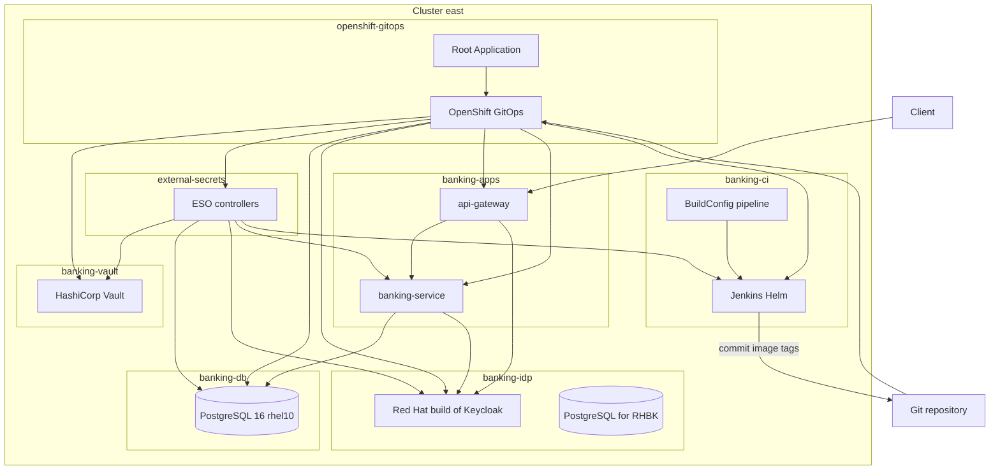

# Architecture

## Overview

This demo runs on a single OpenShift cluster (**east**) and shows a banking API stack secured with OIDC JWTs, backed by PostgreSQL, fronted by Spring Cloud Gateway, and delivered with OpenShift GitOps plus Jenkins CI. Credentials are sourced from **HashiCorp Vault** via the **External Secrets Operator for Red Hat OpenShift**.

## Red Hat / catalog components

| Concern | Component |
| --- | --- |
| Container platform | Red Hat OpenShift |
| GitOps | OpenShift GitOps Operator (Argo CD) |
| Secrets sync | External Secrets Operator for Red Hat OpenShift |
| Secrets backend | HashiCorp Vault (Helm chart, GitOps Application) |
| Identity (OIDC) | Red Hat build of Keycloak (`rhbk-operator`) |
| Banking DB | [`registry.redhat.io/rhel10/postgresql-16`](https://catalog.redhat.com/en/software/containers/rhel10/postgresql-16/677d13af607921b4d74fca88) |
| Keycloak DB | Same PostgreSQL 16 catalog image |
| App runtime images | UBI 9 OpenJDK 21 (`registry.access.redhat.com/ubi9/openjdk-21`) |
| CI | Jenkins via Helm, images from `registry.redhat.io/ocp-tools-4/*` |
| Pipelines trigger | OpenShift `BuildConfig` (`JenkinsPipeline` strategy) |

## App-of-apps

1. Bootstrap installs/ensures OpenShift GitOps.
2. Root Application `banking-demo-root` points at `gitops/applications/east`.
3. Child Applications sync in waves:
   - `0` platform operators (RHBK, ESO Subscription, GitOps)
   - `1` ESO operand (`ExternalSecretsConfig`) + Vault Helm + Vault Route
   - `2` Vault bootstrap (KV, Kubernetes auth, seed data)
   - `3` `ClusterSecretStore` + `ExternalSecret`s
   - `4` PostgreSQL + Jenkins
   - `5` Keycloak (+ Jenkins Route)
   - `6` banking-service
   - `7` api-gateway
   - `8` CI BuildConfigs

Details: [secrets-management.md](secrets-management.md).

## Security model

- Clients obtain an access token from Keycloak realm `banking` (password grant via `banking-cli` for demos, or confidential client `banking-gateway`).
- **api-gateway** validates the JWT (`issuer-uri`) and proxies `/api/**` to **banking-service**.
- **banking-service** is also an OAuth2 resource server and validates the same issuer.
- Actuator health endpoints remain unauthenticated for probes.
- Database and admin passwords are not stored in Git; Vault is the source of truth.

## Future multi-cluster

Placeholders and labels use `cluster: east` so a later phase can add:

- `gitops/applications/west` for a second spoke (AWS or GCP)
- ACM ApplicationSets / Placement for a hub cluster
- Per-spoke `ClusterSecretStore` pointing at Vault (or cloud secret managers)

No west/ACM resources are active in the current scope.
