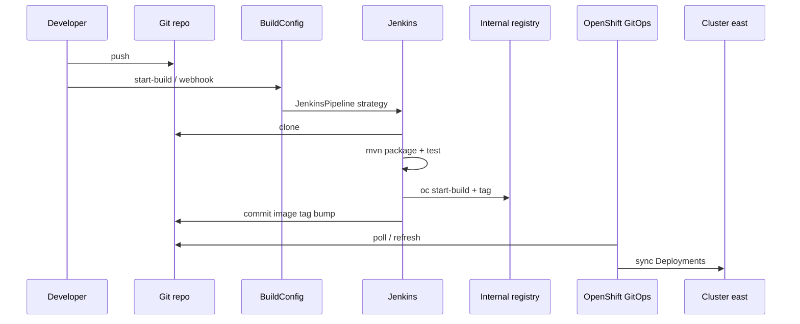

# CI/CD

## Design

| Stage | Tool | Responsibility |
| --- | --- | --- |
| Clone | Jenkins / BuildConfig | Fetch source from Git |
| Maven build | Jenkins | Package `banking-service` and `api-gateway` |
| Tests | Jenkins | Unit/integration tests (`mvn test`) |
| Image build | OpenShift BuildConfig (Docker) | Build UBI-based images into ImageStreams |
| GitOps update | Jenkins | Commit new `newTag` in east overlays |
| Deploy | OpenShift GitOps | Sync Applications to cluster **east** |

Jenkins does **not** deploy with `oc apply` as the source of truth. GitOps owns cluster state.



## Artifacts

- [`ci/Jenkinsfile`](../ci/Jenkinsfile) — pipeline definition
- [`ci/buildconfig/`](../ci/buildconfig/) — `banking-ci-pipeline` (`JenkinsPipeline`) plus binary Docker BuildConfigs
- [`gitops/components/jenkins/helm-values.yaml`](../gitops/components/jenkins/helm-values.yaml) — Helm values (Red Hat Jenkins images)
- [`gitops/applications/east/jenkins.yaml`](../gitops/applications/east/jenkins.yaml) — Argo CD multi-source Application

## Triggering

```bash
# Manual
oc -n banking-ci start-build banking-ci-pipeline --follow

# Webhook secrets (create before relying on GitHub/Generic triggers)
oc -n banking-ci create secret generic banking-github-webhook --from-literal=WebHookSecretKey='replace-me'
oc -n banking-ci create secret generic banking-generic-webhook --from-literal=WebHookSecretKey='replace-me'
```

## Git push from Jenkins

The **GitOps Update** stage pushes tag bumps. Configure Jenkins credentials (username/token or SSH) with write access to the repository, and ensure the agent can reach the Git host.

## Image tags

Overlays under `gitops/components/*/overlays/east/kustomization.yaml` use:

```yaml
images:
  - name: image-registry.openshift-image-registry.svc:5000/banking-apps/<app>
    newTag: <BUILD_NUMBER>
```

Argo CD reconciles Deployments when `newTag` changes.
