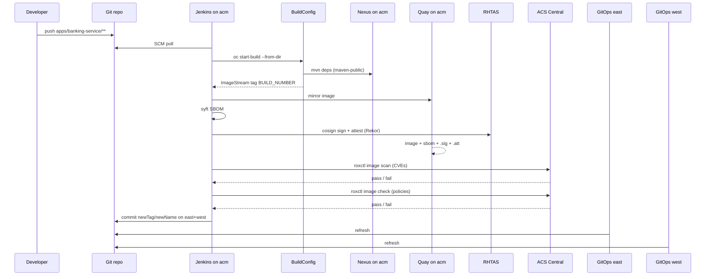

# CI/CD

## Design

Jenkins and BuildConfigs run on hub cluster **acm**. Builds resolve Maven dependencies through **Nexus** (`maven-public` = Maven Central + Red Hat GA). After the image build, pipelines push to **Red Hat Quay**, generate an **SBOM**, **sign/attest** with **RHTAS**, then run **ACS in series** (`image scan` CVEs, then `image check` policies) before GitOps promotion.

| Stage | Tool | Responsibility |
| --- | --- | --- |
| Detect change | Jenkins SCM poll (path-filtered) | Fire only the app pipeline whose paths changed |
| Checkout | Jenkins on acm | Fetch source from Git |
| Image build | OpenShift BuildConfig on acm | Docker build uses `settings.xml` → Nexus; ImageStream tag |
| Mirror + supply chain | `ci/scripts/sign-and-attest.sh` | Push to Quay; Syft SBOM; cosign attach/attest/sign (RHTAS) |
| ACS vulnerabilities | `ci/scripts/acs-image-scan.sh` | `roxctl image scan` — CVE table (first) |
| ACS policies | `ci/scripts/acs-image-check.sh` | `roxctl image check` — policy gate (after CVEs) |
| GitOps update | Jenkins | Commit `newTag` (+ Quay `newName`) in east **and** west overlays |
| Deploy | OpenShift GitOps on managed clusters | Sync Applications → Deployments |

### Maven / Nexus

| Consumer | How |
| --- | --- |
| OpenShift builds | `apps/*/settings.xml` (+ `ci/maven/settings.xml`) → `http://nexus.nexus.svc.cluster.local:8081/repository/maven-public/` |
| Dev Spaces | `devfile.yaml` runs `mvn -s ci/maven/settings.xml …` |
| Laptop | `./scripts/generate-maven-settings.sh > ~/.m2/settings.xml` (uses the Nexus Route) |

Bootstrap repos after Nexus is Ready: `./scripts/bootstrap-nexus.sh`.

### Maven cache (fast CI)

Jenkins runs **`Maven package`** on the controller with a persistent
`${JENKINS_HOME}/.m2/repository` (PVC). The OpenShift Build only copies the jar
(`Dockerfile`) — no Maven download inside the build pod. Use `Dockerfile.full`
for a self-contained local/image build.

Warm once after Nexus is Ready (or after big POM changes):

```bash
./scripts/warm-nexus-maven.sh
```

### ACS (Central + east/west Sensors + CI gate)

```bash
# Sensors on managed clusters → Central on acm
./scripts/bootstrap-acs-secured-clusters.sh

# API token → banking-ci/acs-ci (Jenkins JCasC credentials acs-ci-token / acs-central-url)
./scripts/bootstrap-acs-ci.sh
oc --context acm -n banking-ci delete pod jenkins-0   # reload env into JCasC
```

ACS runs **two sequential stages** after sign/attest (CVEs first):

| Stage | CLI | What it shows | Gate |
| --- | --- | --- | --- |
| ACS vulnerabilities | `roxctl image scan` | CVE table (CRITICAL/IMPORTANT/…) | `ACS_SCAN_FAIL_ON` (default `Critical`) |
| ACS policies | `roxctl image check` | Policy violations (BREAKS BUILD, …) | `ACS_FAIL_ON` (default `Critical`) |

Both require Central (`ACS_REQUIRED=true`). Scripts: `ci/scripts/acs-image-scan.sh`, `ci/scripts/acs-image-check.sh`.

Jenkins does **not** `oc apply` app manifests. GitOps owns cluster state.



## Quay artifacts

For each build, Quay org `banking` should contain:

| Artifact | How |
| --- | --- |
| Image | `skopeo`/`oc image mirror` from ImageStream |
| SBOM | `cosign attach sbom` (CycloneDX) |
| Attestation | `cosign attest --type cyclonedx` (`.att`) |
| Signature | `cosign sign` (`.sig`, Rekor via RHTAS) |

Inspect with `cosign tree <quay-host>/banking/<app>:<tag>`.

## Jenkins jobs

Defined via JCasC Job DSL in [`gitops/components/jenkins/helm-values.yaml`](../gitops/components/jenkins/helm-values.yaml):

| Job | Jenkinsfile | Polls paths |
| --- | --- | --- |
| `banking-service-ci` | [`ci/Jenkinsfile.banking-service`](../ci/Jenkinsfile.banking-service) | `apps/banking-service/**` |
| `api-gateway-ci` | [`ci/Jenkinsfile.api-gateway`](../ci/Jenkinsfile.api-gateway) | `apps/api-gateway/**` |

SCM poll interval: every ~3 minutes (`H/3 * * * *`). Manual **Build with Parameters** (`FORCE_BUILD=true`) always builds.

## Credentials (acm `banking-ci`)

| Secret / Jenkins id | Purpose |
| --- | --- |
| `github-ci` | GitOps push PAT |
| `quay-ci` | Quay robot (`username` / `password`) |
| `cosign-signing-key` | PEM in key `cosign.key` for non-interactive signing |
| `tpa-oidc-cli` | OIDC client secret for uploading SBOMs to TPA |

Without Quay/cosign, the OpenShift build still succeeds; the sign stage is skipped with a warning.

```bash
oc -n banking-ci create secret generic quay-ci \
  --from-literal=username='banking+ci' \
  --from-literal=password='<robot-token>'
oc -n banking-ci create secret generic cosign-signing-key \
  --from-file=cosign.key=./cosign.key
```

## Image BuildConfigs

Binary Docker BuildConfigs in acm `banking-apps` (synced from [`ci/buildconfig/`](../ci/buildconfig/)):

- `banking-service`
- `api-gateway`

## Image tags / Quay promotion

Overlays under `gitops/components/<app>/overlays/{east,west}/kustomization.yaml`:

```yaml
images:
  - name: image-registry.openshift-image-registry.svc:5000/banking-apps/<app>
    newName: <quay-host>/banking/<app>   # set by pipeline after sign
    newTag: <BUILD_NUMBER>
```

Managed clusters need pull access to Quay. After `scripts/bootstrap-quay-ci.sh`, run:

```bash
scripts/sync-quay-pull-secret-to-clusters.sh
# creates banking-apps/quay-pull on east/west (also done by Ansible install)
```
