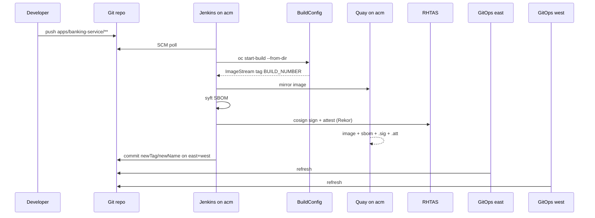

# CI/CD

## Design

Jenkins and BuildConfigs run on hub cluster **acm**. After an OpenShift image build, pipelines push to **Red Hat Quay**, generate an **SBOM**, create a **cosign attestation**, and **sign** with **Red Hat Trusted Artifact Signer** (Rekor/Fulcio). GitOps then bumps image tags on **both** regional cluster overlays.

| Stage | Tool | Responsibility |
| --- | --- | --- |
| Detect change | Jenkins SCM poll (path-filtered) | Fire only the app pipeline whose paths changed |
| Checkout | Jenkins on acm | Fetch source from Git |
| Image build | OpenShift BuildConfig on acm | Binary Docker build into acm `banking-apps` ImageStream |
| Mirror + supply chain | `ci/scripts/sign-and-attest.sh` | Push to Quay; Syft SBOM; cosign attach/attest/sign (RHTAS) |
| GitOps update | Jenkins | Commit `newTag` (+ Quay `newName`) in east **and** west overlays |
| Deploy | OpenShift GitOps on managed clusters | Sync Applications → Deployments |

Jenkins does **not** `oc apply` app manifests. GitOps owns cluster state.



## Quay artifacts

For each build, Quay org `banking` should contain:

| Artifact | How |
| --- | --- |
| Image | `skopeo`/`oc image mirror` from ImageStream |
| SBOM | `cosign attach sbom` (CycloneDX) |
| Attestation | `cosign attest --type cyclonedx` (`.att`) |
| Signature | `cosign sign` (`.sig`, Rekor via RHTAS) |

Inspect with `cosign tree <quay-host>/banking/<app>:<tag>`.

## Jenkins jobs

Defined via JCasC Job DSL in [`gitops/components/jenkins/helm-values.yaml`](../gitops/components/jenkins/helm-values.yaml):

| Job | Jenkinsfile | Polls paths |
| --- | --- | --- |
| `banking-service-ci` | [`ci/Jenkinsfile.banking-service`](../ci/Jenkinsfile.banking-service) | `apps/banking-service/**` |
| `api-gateway-ci` | [`ci/Jenkinsfile.api-gateway`](../ci/Jenkinsfile.api-gateway) | `apps/api-gateway/**` |

SCM poll interval: every ~3 minutes (`H/3 * * * *`). Manual **Build with Parameters** (`FORCE_BUILD=true`) always builds.

## Credentials (acm `banking-ci`)

| Secret / Jenkins id | Purpose |
| --- | --- |
| `github-ci` | GitOps push PAT |
| `quay-ci` | Quay robot (`username` / `password`) |
| `cosign-signing-key` | PEM in key `cosign.key` for non-interactive signing |
| `tpa-oidc-cli` | OIDC client secret for uploading SBOMs to TPA |

Without Quay/cosign, the OpenShift build still succeeds; the sign stage is skipped with a warning.

```bash
oc -n banking-ci create secret generic quay-ci \
  --from-literal=username='banking+ci' \
  --from-literal=password='<robot-token>'
oc -n banking-ci create secret generic cosign-signing-key \
  --from-file=cosign.key=./cosign.key
```

## Image BuildConfigs

Binary Docker BuildConfigs in acm `banking-apps` (synced from [`ci/buildconfig/`](../ci/buildconfig/)):

- `banking-service`
- `api-gateway`

## Image tags / Quay promotion

Overlays under `gitops/components/<app>/overlays/{east,west}/kustomization.yaml`:

```yaml
images:
  - name: image-registry.openshift-image-registry.svc:5000/banking-apps/<app>
    newName: <quay-host>/banking/<app>   # set by pipeline after sign
    newTag: <BUILD_NUMBER>
```

Spokes need pull access to Quay (pull secret in `banking-apps` or global pull secret).
