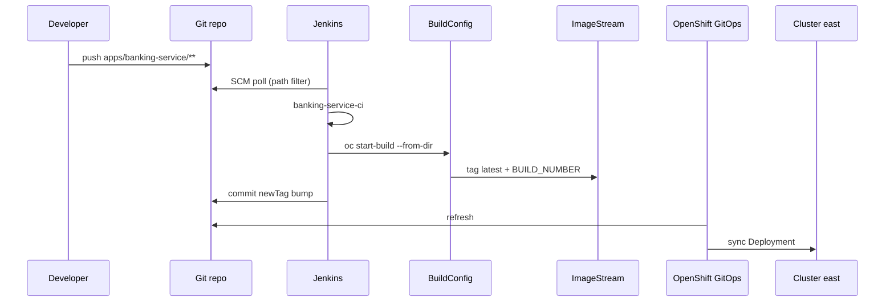

# CI/CD

## Design

| Stage | Tool | Responsibility |
| --- | --- | --- |
| Detect change | Jenkins SCM poll (path-filtered) | Fire only the app pipeline whose paths changed |
| Checkout | Jenkins | Fetch source from Git |
| Image build + push | OpenShift BuildConfig (Docker binary) | Build UBI image into `banking-apps` ImageStream |
| GitOps update | Jenkins | Commit `newTag` in that app’s east overlay |
| Deploy | OpenShift GitOps | Sync Application → Deployment on cluster **east** |

Jenkins does **not** `oc apply` app manifests. GitOps owns cluster state.



## Jenkins jobs

Defined via JCasC Job DSL in [`gitops/components/jenkins/helm-values.yaml`](../gitops/components/jenkins/helm-values.yaml):

| Job | Jenkinsfile | Polls paths |
| --- | --- | --- |
| `banking-service-ci` | [`ci/Jenkinsfile.banking-service`](../ci/Jenkinsfile.banking-service) | `apps/banking-service/**`, shared CI scripts |
| `api-gateway-ci` | [`ci/Jenkinsfile.api-gateway`](../ci/Jenkinsfile.api-gateway) | `apps/api-gateway/**`, shared CI scripts |

Shared logic: [`ci/vars/appPipeline.groovy`](../ci/vars/appPipeline.groovy).

SCM poll interval: every ~3 minutes (`H/3 * * * *`). Manual **Build with Parameters** (`FORCE_BUILD=true`) always builds.

## Image BuildConfigs

Binary Docker BuildConfigs in `banking-apps` (synced from [`ci/buildconfig/`](../ci/buildconfig/)):

- `banking-service`
- `api-gateway`

## GitHub credentials (GitOps push)

Jenkins credential id `github-ci` (username + PAT) comes from Secret `banking-ci/github-ci` via External Secrets / Conjur (`banking/github-ci/*`).

Set a real PAT (repo scope) in Conjur, then refresh:

```bash
# After storing the token in Conjur (or patching the Secret):
oc -n banking-ci get secret github-ci
# Restart Jenkins so JCasC/env picks up a rotated token if needed:
oc -n banking-ci delete pod jenkins-0
```

Without a valid token, image build still works; the **GitOps update** stage fails until the PAT is configured.

## Triggering

- **Automatic:** push to `main` under the app’s path → matching Jenkins job on next poll  
- **Manual:** Jenkins UI → `banking-service-ci` / `api-gateway-ci` → Build with Parameters  

## Image tags

Overlays under `gitops/components/<app>/overlays/east/kustomization.yaml`:

```yaml
images:
  - name: image-registry.openshift-image-registry.svc:5000/banking-apps/<app>
    newTag: <BUILD_NUMBER>
```

Argo CD reconciles Deployments when `newTag` changes.
