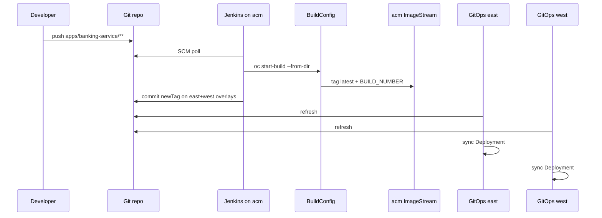

# CI/CD

## Design

Jenkins and BuildConfigs run on hub cluster **acm**. Pipelines bump image tags on **both** spoke overlays so RHACM/GitOps refreshes east and west.

| Stage | Tool | Responsibility |
| --- | --- | --- |
| Detect change | Jenkins SCM poll (path-filtered) | Fire only the app pipeline whose paths changed |
| Checkout | Jenkins on acm | Fetch source from Git |
| Image build + push | OpenShift BuildConfig on acm | Build UBI image into acm `banking-apps` ImageStream |
| GitOps update | Jenkins | Commit `newTag` in east **and** west overlays |
| Deploy | OpenShift GitOps on spokes | Sync Applications → Deployments |
| Mirror (if needed) | `scripts/mirror-image-to-spokes.sh` | Copy image from acm registry to spoke registries |

Jenkins does **not** `oc apply` app manifests. GitOps owns cluster state.



## Jenkins jobs

Defined via JCasC Job DSL in [`gitops/components/jenkins/helm-values.yaml`](../gitops/components/jenkins/helm-values.yaml):

| Job | Jenkinsfile | Polls paths |
| --- | --- | --- |
| `banking-service-ci` | [`ci/Jenkinsfile.banking-service`](../ci/Jenkinsfile.banking-service) | `apps/banking-service/**` |
| `api-gateway-ci` | [`ci/Jenkinsfile.api-gateway`](../ci/Jenkinsfile.api-gateway) | `apps/api-gateway/**` |

SCM poll interval: every ~3 minutes (`H/3 * * * *`). Manual **Build with Parameters** (`FORCE_BUILD=true`) always builds.

## Image BuildConfigs

Binary Docker BuildConfigs in acm `banking-apps` (synced from [`ci/buildconfig/`](../ci/buildconfig/)):

- `banking-service`
- `api-gateway`

## GitHub credentials (GitOps push)

Jenkins credential id `github-ci` comes from Secret `banking-ci/github-ci` via External Secrets / Conjur on **acm**.

Without a valid PAT, image build still works; GitOps update is skipped and the pipeline may `rollout restart` on acm only. Mirror to spokes separately if needed.

## Image tags

Overlays under `gitops/components/<app>/overlays/{east,west}/kustomization.yaml`:

```yaml
images:
  - name: image-registry.openshift-image-registry.svc:5000/banking-apps/<app>
    newTag: <BUILD_NUMBER>
```

If spokes cannot pull from the acm registry:

```bash
scripts/mirror-image-to-spokes.sh banking-service <BUILD_NUMBER>
scripts/mirror-image-to-spokes.sh api-gateway <BUILD_NUMBER>
```
