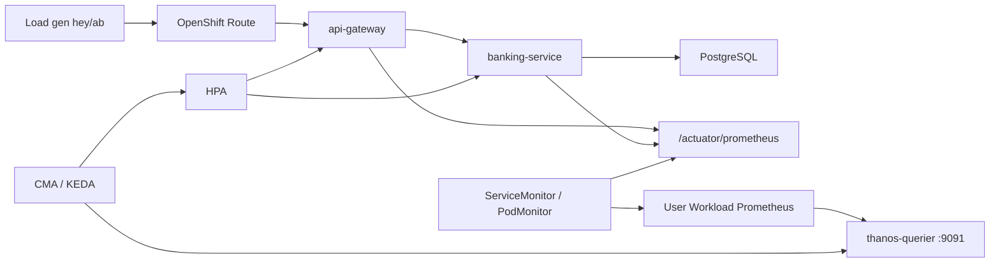

# Custom Metrics Autoscaler (KEDA) for Spring apps

This demo uses the **Red Hat OpenShift Custom Metrics Autoscaler Operator** (CMA) — the supported build of [KEDA](https://keda.sh/) — to scale the Spring banking apps from **1** to about **10** pods based on CPU and Prometheus HTTP request rate.

Community KEDA is **not** used. Scale-out is **idle until you generate load** (or CPU rises).

## Architecture



| Layer | Resource |
| --- | --- |
| Operator (wave 0) | Subscription `openshift-custom-metrics-autoscaler-operator` in `openshift-keda` ([`gitops/platform/operators-spoke`](../gitops/platform/operators-spoke)) |
| Operand (wave 1) | `KedaController` + cluster RBAC for Thanos ([`gitops/components/keda`](../gitops/components/keda)) |
| Per app namespace | `TriggerAuthentication` `keda-prom-auth` (bound SA token) in `banking-apps` / `banking-si-apps` |
| Per Deployment | `ScaledObject` + `ServiceMonitor` (mesh) or `PodMonitor` (SI `banking-service`) |

Applies to **both** demo stacks on east/west:

- Mesh: `banking-apps` — `api-gateway`, `banking-service`
- Service Interconnect: `banking-si-apps` — `api-gateway`, `banking-service`

## ScaledObject policy

Each ScaledObject:

- `minReplicaCount: 1` (no scale-to-zero)
- `maxReplicaCount: 10`
- `pollingInterval: 15` / `cooldownPeriod: 60`
- Triggers:
  1. **CPU** — `Utilization` target `60%` (baseline)
  2. **Prometheus** — `sum(rate(http_server_requests_seconds_count{namespace=…,container=…}[1m]))` with `threshold: "10"` (desired replicas ≈ metric / threshold)

Query path: Spring `/actuator/prometheus` → UWM scrape → **`thanos-querier.openshift-monitoring:9091`** (web port; not `:9092` tenancy) with bearer token via `TriggerAuthentication`.

User-workload monitoring must stay enabled ([`gitops/components/monitoring-user-workload`](../gitops/components/monitoring-user-workload)).

## Spring metrics and health

Apps expose (unauthenticated for probes / in-cluster scrape):

- `/actuator/health/liveness` and `/actuator/health/readiness`
- `/actuator/prometheus` (Micrometer)

**banking-service** readiness includes the **db** indicator. Deployments use:

| Probe | Timing |
| --- | --- |
| `startupProbe` → liveness | every 10s, fail after 30 (~5 min cold start) |
| `readinessProbe` | every 5s, fail after 3 |
| `livenessProbe` | every 15s, fail after 3 |

## How to see the scale-out

Idle state stays at **1** replica. Generate HTTP load, then watch HPA / pods.

### Demo script

```bash
# Mesh stack on east (default)
./scripts/demo-keda-scale.sh

# SI stack
BANKING_NS=banking-si-apps ./scripts/demo-keda-scale.sh

# Heavier / longer load only
CONCURRENCY=60 LOAD_SECONDS=180 ./scripts/demo-keda-scale.sh load
```

Requires `hey` (preferred) or Apache Bench (`ab`), plus a working Keycloak token (same credentials as the failover demos).

### Watch commands

`oc … -w` accepts **one** resource type only:

```bash
# Best signal: desired vs current replicas
oc --context east -n banking-apps get hpa -w

# ScaledObject READY / ACTIVE
oc --context east -n banking-apps get scaledobject -w

# Pod churn
oc --context east -n banking-apps get pods \
  -l 'app.kubernetes.io/name in (api-gateway,banking-service)' -w
```

Snapshot (no watch):

```bash
oc --context east -n banking-apps get scaledobject,hpa,pods
oc --context east -n openshift-keda get pods
```

When load rises you should see `ACTIVE True`, HPA `REPLICAS` climbing toward 10, and new pods.

### Manual load

```bash
TOKEN=$(curl -sk -X POST \
  "https://$(oc --context acm -n banking-idp get route sso -o jsonpath='{.spec.host}')/realms/banking/protocol/openid-connect/token" \
  -d 'client_id=banking-cli' -d 'username=teller' -d 'password=teller-change-me' \
  -d 'grant_type=password' | jq -r .access_token)

URL="https://$(oc --context east -n banking-apps get route api-gateway -o jsonpath='{.spec.host}')"

hey -z 2m -c 50 -H "Authorization: Bearer ${TOKEN}" "${URL}/api/v1/customers"
# or: ab -t 120 -c 50 -H "Authorization: Bearer ${TOKEN}" "${URL}/api/v1/customers"
```

Threshold `10` ≈ **10 RPS per desired replica** (~100 RPS → ~10 pods). After load stops, cooldown (~60s+) scales back toward 1.

## Capacity note

On small / single-node spokes the HPA may **desire** 10 replicas while some pods stay `Pending` (`Insufficient cpu`). That still proves CMA; for 10 Ready pods add workers or lower CPU requests.

## Notes

- Do **not** attach a separate HPA to the same Deployment; CMA creates and owns the HPA.
- Images must expose `/actuator/prometheus` (Micrometer). Rebuild via CI after app changes.
- Related: [architecture.md](architecture.md), [observability-perses.md](observability-perses.md), [multi-cluster.md](multi-cluster.md).
