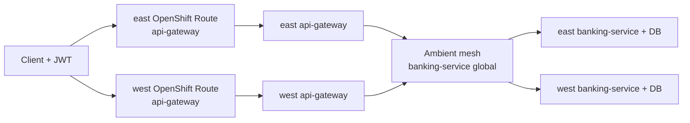
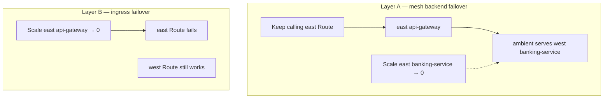

# Service Mesh failover (OSSM ambient + OpenShift Routes)

Live demo path for **OpenShift Service Mesh 3.4 ambient** across east/west. It proves the banking API stays available when a regional cluster loses its **backend**, using mesh locality — not shared data.

Parallel path (isolated namespaces): [service-interconnect-failover.md](service-interconnect-failover.md).

| Layer | Product | Role |
| --- | --- | --- |
| Application network | **OSSM 3.4 ambient** (Sail / Istio ~1.30, ztunnel) | Cross-cluster `banking-service` via HBONE east-west gateway + DestinationRule locality |
| Entry | **OpenShift Route** per cluster | `api-gateway` Route in `banking-apps` on east and on west |
| Graph | **Kiali** (multi-cluster on acm) + OSSMC console plugin | Traffic topology for `banking-apps` |
| Metrics UI | **Red Hat build of Perses** on acm | HTTP rates and ready replicas by `cluster=east\|west` via promxy |

There is **no** shared global DNS / Connectivity Link on this path. Each cluster has its own Route.

**Traffic failover ≠ data failover.** PostgreSQL stays local per cluster (`banking-db`).

## Namespaces

| Namespace | Clusters | Contents |
| --- | --- | --- |
| `banking-apps` | east, west | api-gateway, banking-service (+ waypoint), CMA ScaledObjects; ambient dataplane |
| `banking-db` | east, west | Local PostgreSQL (not `istio.io/global`) |
| `istio-system` | east, west | Istio control plane, east-west Gateway, shared `cacerts` |

Namespaces `banking-apps` / `banking-db` are labeled `istio.io/dataplane-mode=ambient`.

## Architecture





- **OIDC** from hub Keycloak (`banking-idp` / realm `banking`).
- Responses include `X-Banking-Cluster: east|west` when the image includes `ClusterIdentityFilter`.
- DestinationRule `banking-service-failover`: `outlierDetection` + `localityLbSetting.failoverPriority: topology.istio.io/cluster`.
- Service `banking-service`: `istio.io/global=true` + waypoint (waypoint Service stays cluster-local).
- On AWS: keep EW Gateway status IPs synced (`scripts/mesh/sync-eastwest-gateway-ips.sh` — also run from `demo-mesh-failover.sh preflight`).

GitOps mesh details: [`gitops/components/mesh`](../gitops/components/mesh).

## Prerequisites

1. Ansible install (or manual bootstrap) with east/west meshes Ready — [multi-cluster.md](multi-cluster.md).
2. Shared CA + peering once both meshes are up:

```bash
./scripts/mesh/sync-shared-cacerts.sh
./scripts/mesh/exchange-remote-secrets.sh
./scripts/mesh/sync-kiali-multicluster-secrets.sh
./scripts/mesh/enable-user-workload-monitoring.sh   # if not already via GitOps
./scripts/mesh/sync-promxy.sh
```

3. Hub Kiali Ready with remote cluster secrets; Perses dashboards synced ([observability-perses.md](observability-perses.md)).

## Presenting the live demo

```bash
./scripts/demo-mesh-failover.sh           # interactive — press Enter between steps
./scripts/demo-mesh-failover.sh preflight
./scripts/demo-mesh-failover.sh status
```

Env (optional): `ENTRY_CLUSTER=east` `FAIL_CLUSTER=east` `HUB_CONTEXT=acm`.

### What the script proves

| Layer | Action | Expected |
| --- | --- | --- |
| **A — MESH** | Scale `banking-service` on fail cluster → 0 | Keep calling **entry** Route; ambient serves peer; `★ WEST ★` (or peer) while east backend pods = 0 |
| **B — INGRESS** | Scale `api-gateway` on fail cluster → 0 | Entry Route fails; **peer** Route still works (no shared DNS) |

Recover with the script’s recover step (or scale Deployments back to 1; CMA may also restore min replicas).

### Kiali — second screen

```bash
echo "https://$(oc --context acm -n istio-system get route kiali -o jsonpath='{.spec.host}')"
```

1. Open Kiali on **acm** (multi-cluster).
2. Graph / traffic for namespace **`banking-apps`**.
3. During Layer A, watch edges shift toward the peer cluster while clients still hit the entry Route.
4. Optional: OpenShift console **Service Mesh** plugin (OSSMC) on acm.

### Perses — third screen

```bash
./scripts/perses-url.sh
# Observe → Dashboards (Perses) on the acm console
```

Open **Banking failover compare (east vs west)** with `apps_ns=banking-apps`. Ready replicas and HTTP rates by cluster update via hub promxy while traffic runs. See [observability-perses.md](observability-perses.md).

### What the terminal shows

Each sample prints a **request/response card**:

- `▶ REQUEST` — `curl` against the OpenShift Route URL  
- `◀ RESPONSE` — HTTP status, `★ EAST/WEST ★` (serving cluster), pod counts  
- customer list + pretty JSON (preflight seeds Ada/Grace/Alan on **both** DBs)

Detail log: `.demo-failover.log` (override with `DETAIL_LOG=`).

## Checklist (mesh peering)

- [ ] Sail / `servicemeshoperator3` Succeeded on east and west  
- [ ] `Istio` / `IstioCNI` / `ZTunnel` Ready (`profile: ambient`, `v1.30-latest`)  
- [ ] `banking-apps` labeled `istio.io/dataplane-mode=ambient`  
- [ ] `banking-service` Service has `istio.io/global=true` and waypoint  
- [ ] East-west Gateway + passthrough Route on both clusters  
- [ ] Shared `cacerts` + remote secrets exchanged  
- [ ] DestinationRule `banking-service-failover` present  
- [ ] Hub Kiali Ready with east/west remote secrets  

## Related docs

- [Observability (Perses + promxy)](observability-perses.md)
- [Service Interconnect failover](service-interconnect-failover.md)
- [Multi-cluster install](multi-cluster.md)
- [Architecture](architecture.md)
- [KEDA autoscaling](keda-autoscaling.md)
