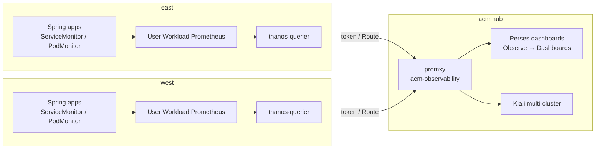

# Observability — Perses, promxy, and multi-cluster metrics

The hub (**acm**) federates east/west metrics and exposes them in the OpenShift console through the **Red Hat build of Perses** (Cluster Observability Operator), using the same **promxy** path as hub Kiali.

## Architecture



| Piece | Where | Role |
| --- | --- | --- |
| User-workload monitoring | east / west | Scrapes app + mesh metrics |
| Thanos Querier | `openshift-monitoring` on each spoke | Query API (`:9091` web) |
| promxy | `acm-observability` on acm | Fans out PromQL with `cluster=east\|west` |
| Cluster Observability Operator | acm | Red Hat Perses + Monitoring UIPlugin |
| Perses dashboards | `acm-observability` | GitOps `PersesDashboard` CRs |
| Kiali | `istio-system` on acm | Mesh graph (separate UI; same promxy metrics source) |
| Network Observer | west `banking-si-apps` | SI topology (not Perses) |

GitOps:

- Operator: [`gitops/platform/operators-hub/subscription-coo.yaml`](../gitops/platform/operators-hub/subscription-coo.yaml)
- Perses UIPlugin + datasource + dashboards: [`gitops/components/perses`](../gitops/components/perses)
- Argo Application: [`gitops/applications/acm/perses.yaml`](../gitops/applications/acm/perses.yaml)
- promxy: [`gitops/components/promxy`](../gitops/components/promxy)

## Open Perses

Perses is **embedded in the OpenShift console** (not a standalone Route):

```bash
./scripts/perses-url.sh
./scripts/perses-url.sh open   # macOS
```

Or: acm console → **Observe → Dashboards (Perses)**.

ApplicationLauncher link (after bootstrap): [`scripts/apply-console-links.sh`](../scripts/apply-console-links.sh).

## Dashboards

Namespace: `acm-observability`. Datasource: **Promxy (east + west)** → `http://promxy.acm-observability.svc.cluster.local:8082`.

| CR name | Display name | Use |
| --- | --- | --- |
| `banking-http-overview` | **Banking HTTP (multi-cluster)** | Spring HTTP rates / URI / errors via promxy. Variables: `cluster`, `namespace` (`banking-apps` or `banking-si-apps`) |
| `banking-failover-compare` | **Banking failover compare (east vs west)** | Side-by-side ready replicas (`banking-service`, `api-gateway`) and HTTP rates. Variable: `apps_ns` for mesh vs SI |

### During mesh failover

1. Run [`./scripts/demo-mesh-failover.sh`](../scripts/demo-mesh-failover.sh) — [mesh-failover.md](mesh-failover.md).
2. Keep Kiali graph open for `banking-apps`.
3. In Perses open **Banking failover compare** with `apps_ns=banking-apps`.
4. When east `banking-service` scales to 0, replica panels and rates should show traffic/serving shift while the **east** Route is still the client target.

### During SI failover

Same Perses dashboard with `apps_ns=banking-si-apps`, plus Network Observer on west — [service-interconnect-failover.md](service-interconnect-failover.md).

### During KEDA scale-out

Use **Banking HTTP (multi-cluster)** (request rate) and/or `oc get hpa -w` — [keda-autoscaling.md](keda-autoscaling.md). Perses shows rates; HPA shows desired replicas.

## Bootstrap order (metrics path)

Covered by Ansible / [multi-cluster.md](multi-cluster.md):

1. Enable user-workload monitoring on spokes (GitOps `user-workload-monitoring` or `scripts/mesh/enable-user-workload-monitoring.sh`).
2. Mesh `PodMonitor`s + app `ServiceMonitor`s / `PodMonitor`s.
3. Hub promxy + Thanos reader tokens (`scripts/mesh/sync-promxy.sh`, Ansible `promxy_tokens`).
4. COO Subscription + Perses Application sync on acm.
5. Optional: console links including Perses.

## Verify

```bash
oc --context acm -n acm-observability get persesdashboard,persesglobaldatasource
oc --context acm -n openshift-cluster-observability-operator get csv 2>/dev/null || \
  oc --context acm get csv -A | rg -i 'cluster-observability|coo'
./scripts/perses-url.sh
```

## Related docs

- [Mesh failover](mesh-failover.md) — Kiali + Perses during ambient failover  
- [Service Interconnect failover](service-interconnect-failover.md) — Network Observer + Perses  
- [KEDA autoscaling](keda-autoscaling.md) — app Prometheus → Thanos → CMA  
- [Architecture](architecture.md) · [Multi-cluster](multi-cluster.md)
