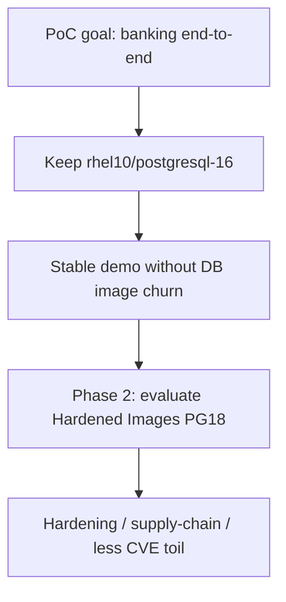

# PostgreSQL image recommendation (PoC)

## Executive summary

For this PoC we keep PostgreSQL 16 from the Red Hat Ecosystem Catalog (`rhel10/postgresql-16`): it is already a supported Red Hat image and lets us demonstrate the banking use case without migration risk. [Red Hat Hardened Images](https://images.redhat.com/?name=postgresql&version=18) (PostgreSQL 18) deliver real value on attack surface, image size, and CVE toil, and should be evaluated in a later hardening phase—not as a PoC blocker.

## PoC decision

**Keep [`registry.redhat.io/rhel10/postgresql-16`](https://catalog.redhat.com/en/software/containers/rhel10/postgresql-16/677d13af607921b4d74fca88).** Do not migrate to Hardened Images for the PoC.

| Item | PoC choice |
| --- | --- |
| Banking DB | [`gitops/components/postgresql/deployment.yaml`](../gitops/components/postgresql/deployment.yaml) → `rhel10/postgresql-16:latest` |
| Keycloak DB | [`gitops/components/keycloak/base/keycloak-db.yaml`](../gitops/components/keycloak/base/keycloak-db.yaml) → same image family |
| Success criteria | Banking API + Keycloak + secrets working end-to-end |

Why this fits the PoC:

- Goal is banking (Spring + gateway + OIDC + GitOps + mesh + secrets), not database image hardening.
- Current GitOps assumes the SCL/RHEL contract (`POSTGRESQL_*` env vars, `/usr/libexec/check-container` probes, data path `/var/lib/pgsql/data`).
- Changing to Hardened Images (Postgres 18, distroless) needs manifest rewrites and a 16→18 data upgrade with no functional gain for “make banking run.”

## What Hardened Images would add (roadmap, not PoC)

| Value | Detail |
| --- | --- |
| Smaller attack surface | Distroless: no shell or package manager by default |
| Less CVE noise | Fewer packages → fewer scanner findings |
| Smaller image | Faster pulls, less registry/storage use |
| PostgreSQL 18 | Newer major version |
| No-cost catalog | Usable outside the classic App Streams cycle |

References: [Hardened Images benefits](https://developers.redhat.com/articles/2026/05/12/red-hat-hardened-images-top-5-benefits-software-developers), [UBI vs Hardened Images](https://developers.redhat.com/articles/2026/06/29/red-hat-ubi-vs-red-hat-hardened-images-how-to-choose), [catalog](https://images.redhat.com/?name=postgresql&version=18).

## Migration cost (out of PoC scope)

1. Env vars: `POSTGRESQL_*` → typical upstream `POSTGRES_*`.
2. Probes: replace `/usr/libexec/check-container` with TCP / `pg_isready`.
3. Data path and 16→18 upgrade (dump/restore; existing PVC is not drop-in).
4. Align Keycloak DB if the same image policy is required.
5. Accept harder in-container debug (no shell).

## Phased approach for the client

| Phase | Action | Success criteria |
| --- | --- | --- |
| **PoC (now)** | Stay on `rhel10/postgresql-16` | Banking API + Keycloak + secrets working |
| **Post-PoC (optional)** | Spike Hardened Images PostgreSQL 18 on a trial spoke | Manifests adapted, data migration validated, scanners quieter |

### Post-PoC spike checklist

If the client prioritizes hardening after the PoC:

1. Pull Hardened Images PostgreSQL 18 and document registry/auth requirements.
2. Adapt banking PostgreSQL Deployment (env, probes, volume mount) on one spoke only.
3. Prove empty-volume bootstrap and a dump/restore path from 16 → 18.
4. Re-run banking smoke tests (customers, accounts, transfers) and Keycloak login.
5. Compare scanner findings vs `rhel10/postgresql-16`.
6. Decide whether to roll the same change to Keycloak DB and the peer spoke.
