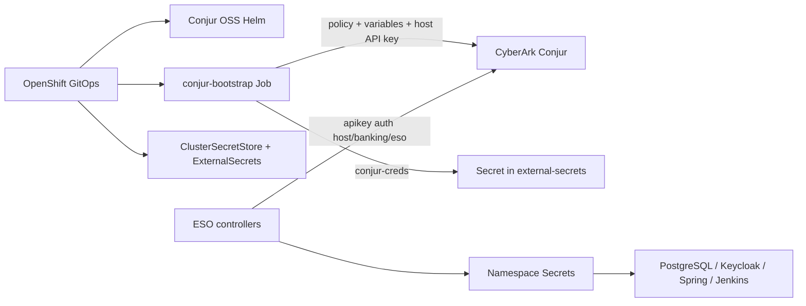

# Secrets management (CyberArk Conjur + External Secrets)

This demo keeps credentials out of Git. **CyberArk Conjur OSS** stores secret values; the **External Secrets Operator for Red Hat OpenShift** synchronizes them into namespace `Secret` objects consumed by workloads.

**Applications never call Conjur (or any vault) directly.** Only ESO authenticates to Conjur and materializes Kubernetes Secrets.



| Piece | Location |
| --- | --- |
| Conjur OSS (Helm) | [`gitops/components/conjur/helm-values.yaml`](../gitops/components/conjur/helm-values.yaml) via Application `conjur` |
| Conjur Route + ImageStreams | [`gitops/components/conjur/`](../gitops/components/conjur/) |
| Policy / seed / ESO host | [`gitops/components/conjur-config/`](../gitops/components/conjur-config/) Job |
| `ClusterSecretStore` + `ExternalSecret`s | [`gitops/components/external-secrets/`](../gitops/components/external-secrets/) |

## Sync waves

| Wave | Applications |
| --- | --- |
| 1 | `eso-operand`, `conjur`, `conjur-route` |
| 2 | `conjur-config` (bootstrap Job) |
| 3 | `external-secrets-config` (`ClusterSecretStore` + `ExternalSecret`s) |

## Conjur variables (account `banking`)

| Variable ID | Consumed by |
| --- | --- |
| `banking/postgresql/*` | `ExternalSecret/postgresql-credentials` → `banking-db` |
| `banking/keycloak-db/*` | `ExternalSecret/keycloak-db-secret` → `banking-idp` |
| `banking/keycloak-admin/*` | `ExternalSecret/keycloak-admin` → `banking-idp` |
| `banking/banking-service/*` | `ExternalSecret/banking-service-db` → `banking-apps` |
| `banking/jenkins/*` | `ExternalSecret/jenkins-admin` → `banking-ci` |

Each Conjur variable maps 1:1 to an `ExternalSecret` `remoteRef.key` (no Vault-style `property` field).

## Bootstrap behaviour

Conjur runs as a single Helm release (`conjur-oss`) with TLS terminated by the chart’s nginx sidecar. On first sync, Job `conjur-bootstrap`:

1. Waits for the Conjur Deployment and HTTPS endpoint
2. Retrieves the `admin` API key via `conjurctl` in the Conjur pod
3. Loads policy `banking` (variables + host `banking/eso`)
4. Seeds demo secret values
5. Rotates the API key for `host/banking/eso` and stores it in Secret `external-secrets/conjur-creds`

To re-run bootstrap after a failure:

```bash
oc -n banking-conjur delete job conjur-bootstrap --ignore-not-found
oc -n openshift-gitops annotate application conjur-config argocd.argoproj.io/refresh=hard --overwrite
```

## ESO `ClusterSecretStore`

`ClusterSecretStore/conjur-backend` uses Conjur **apikey** auth:

- Account: `banking`
- Host: `host/banking/eso` (from `conjur-creds`)
- URL: `https://conjur-oss.banking-conjur.svc`
- CA: chart Secret `banking-conjur/conjur-oss-conjur-ssl-ca-cert`

```bash
oc get pods -n banking-conjur
oc get job -n banking-conjur
oc get secret conjur-creds -n external-secrets
oc get clustersecretstore conjur-backend
oc get externalsecret -A
```

## Future multi-cluster

Keep the same `ExternalSecret` manifests. Point each spoke’s `ClusterSecretStore` at a reachable Conjur (or CyberArk Secrets Manager). Optionally add cloud `ClusterSecretStore`s later without changing application Deployments.
