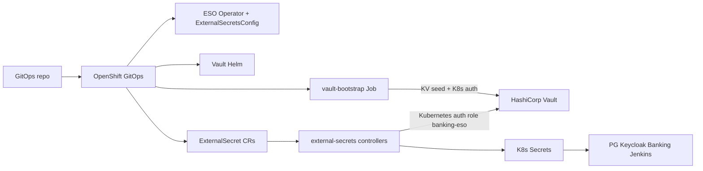

# Secrets management (Vault + External Secrets)

This demo keeps credentials out of Git. **HashiCorp Vault** stores secret values; the **External Secrets Operator for Red Hat OpenShift** synchronizes them into namespace `Secret` objects consumed by workloads.

## Architecture



| Piece | How it is delivered |
| --- | --- |
| ESO Operator Subscription | [`gitops/platform/operators/`](../gitops/platform/operators/) |
| ESO operand (`ExternalSecretsConfig`) | [`gitops/platform/eso-operand/`](../gitops/platform/eso-operand/) |
| Vault (Helm) | [`gitops/components/vault/helm-values.yaml`](../gitops/components/vault/helm-values.yaml) via Application `vault` |
| Vault UI Route | [`gitops/components/vault/`](../gitops/components/vault/) |
| Init / KV / auth / seed | [`gitops/components/vault-config/`](../gitops/components/vault-config/) Job |
| `ClusterSecretStore` + `ExternalSecret` | [`gitops/components/external-secrets/`](../gitops/components/external-secrets/) |

## Sync waves

| Wave | Application |
| --- | --- |
| 0 | `platform-operators` (ESO + RHBK + GitOps subscriptions) |
| 1 | `eso-operand`, `vault`, `vault-route` |
| 2 | `vault-config` (bootstrap Job) |
| 3 | `external-secrets-config` |
| 4+ | PostgreSQL, Jenkins, Keycloak, apps, CI |

## Vault paths (KV v2 mount `secret/`)

| Path | Target Secret | Namespace |
| --- | --- | --- |
| `banking/postgresql` | `postgresql-credentials` | `banking-db` |
| `banking/keycloak-db` | `keycloak-db-secret` | `banking-idp` |
| `banking/keycloak-admin` | `keycloak-admin` | `banking-idp` |
| `banking/banking-service` | `banking-service-db` | `banking-apps` |
| `banking/jenkins` | `jenkins-admin` | `banking-ci` |

Properties match the keys expected by Deployments / Helm (for example `database-password`, `SPRING_DATASOURCE_PASSWORD`, `jenkins-admin-password`).

## Bootstrap and unseal

Vault runs in **standalone** mode with file storage (demo, not HA). On first sync, Job `vault-bootstrap`:

1. Initializes Vault with **1 key share / threshold 1** (demo only)
2. Stores root token + unseal key in Secret `banking-vault/vault-root-token`
3. Unseals Vault
4. Enables `kv-v2` at `secret/`, policy `banking-eso-read`, Kubernetes auth role `banking-eso`
5. Seeds the paths above

If the Job fails before init completes, run:

```bash
./scripts/vault-init-unseal.sh
oc -n openshift-gitops annotate application vault-config argocd.argoproj.io/refresh=hard --overwrite
```

**Do not use single-share init or a root-token Secret outside workshops.**

## External Secrets auth

`ClusterSecretStore/vault-backend` uses Kubernetes auth:

- Vault role: `banking-eso`
- Bound SA: `external-secrets` in namespace `external-secrets`
- Policy: read `secret/data/banking/*`

Refresh interval on `ExternalSecret` resources is `1h` (adjust as needed).

## Verify

```bash
oc get pods -n banking-vault
oc get pods -n external-secrets
oc get clustersecretstore vault-backend
oc get externalsecret -A
oc get secret postgresql-credentials -n banking-db
```

## Future multi-cloud (AWS + GCP)

Keep the same `ExternalSecret` manifests. Point each spoke’s `ClusterSecretStore` at a reachable Vault (or replicate Vault). Optionally add cloud `ClusterSecretStore`s (AWS Secrets Manager / GCP Secret Manager) later without changing application Deployments.

## Hardening backlog

- Vault HA Raft + AWS KMS (or GCP KMS) auto-unseal
- Remove demo root-token Secret; use short-lived bootstrap tokens
- Sealed Secrets / External Secrets push-secret patterns for Git-safe rotation workflows
