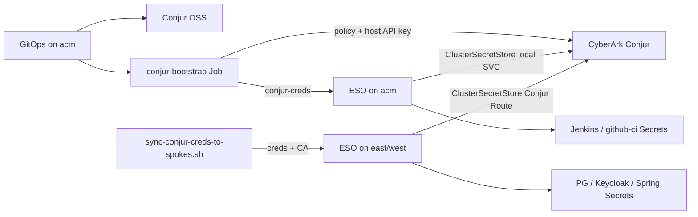

# Secrets management (CyberArk Conjur + External Secrets)

This demo keeps credentials out of Git. **CyberArk Conjur OSS** on cluster **acm** stores secret values; the **External Secrets Operator** on acm and on each spoke synchronizes them into namespace `Secret` objects.

**Applications never call Conjur (or any vault) directly.** Only ESO authenticates to Conjur and materializes Kubernetes Secrets.



| Piece | Location |
| --- | --- |
| Conjur OSS | [`gitops/components/conjur/`](../gitops/components/conjur/) on **acm** |
| Policy / seed / ESO host | [`gitops/components/conjur-config/`](../gitops/components/conjur-config/) on **acm** |
| Hub `ClusterSecretStore` + Jenkins ES | [`gitops/components/external-secrets-hub/`](../gitops/components/external-secrets-hub/) |
| Spoke `ClusterSecretStore` + app ES | [`gitops/components/external-secrets/`](../gitops/components/external-secrets/) |

## Hub vs spoke

| Cluster | Conjur URL in ClusterSecretStore | ExternalSecrets |
| --- | --- | --- |
| acm | `https://conjur-oss.banking-conjur.svc` | jenkins-admin, github-ci |
| east / west | `https://conjur-oss-banking-conjur.REPLACE_ME_ACM_APPS_DOMAIN` | postgresql, keycloak, banking-service |

After Conjur bootstrap on acm, copy credentials:

```bash
scripts/sync-conjur-creds-to-spokes.sh
```

That creates `external-secrets/conjur-creds` and `external-secrets/conjur-ssl-ca` on each spoke. Spokes must reach the acm Conjur Route over HTTPS.

## Sync waves (acm)

| Wave | Applications |
| --- | --- |
| 1 | `eso-operand`, `conjur` |
| 2 | `conjur-config` (bootstrap Job) |
| 3 | `external-secrets-config` (hub store + Jenkins secrets) |
| 4+ | Jenkins, CI BuildConfigs |

## Conjur variables (account `banking`)

| Variable ID | Consumed by |
| --- | --- |
| `banking/postgresql/*` | Spoke `ExternalSecret/postgresql-credentials` |
| `banking/keycloak-db/*` | Spoke `ExternalSecret/keycloak-db-secret` |
| `banking/keycloak-admin/*` | Spoke `ExternalSecret/keycloak-admin` |
| `banking/banking-service/*` | Spoke `ExternalSecret/banking-service-db` |
| `banking/jenkins/*` | Hub `ExternalSecret/jenkins-admin` |
| `banking/github-ci/*` | Hub `ExternalSecret/github-ci` |

## Bootstrap behaviour

On first sync on acm, Job `conjur-bootstrap`:

1. Waits for the Conjur Deployment and HTTPS endpoint
2. Retrieves the `admin` API key via `conjurctl`
3. Loads policy `banking` (variables + host `banking/eso`)
4. Seeds demo secret values
5. Stores host API key in Secret `external-secrets/conjur-creds`

```bash
oc --context acm -n banking-conjur delete job conjur-bootstrap --ignore-not-found
oc --context acm -n openshift-gitops annotate application conjur-config argocd.argoproj.io/refresh=hard --overwrite
```

## Verify

```bash
oc --context acm get pods -n banking-conjur
oc --context acm get secret conjur-creds -n external-secrets
oc --context east get clustersecretstore conjur-backend
oc --context east get externalsecret -A
oc --context west get externalsecret -A
```

See also [multi-cluster.md](multi-cluster.md).
