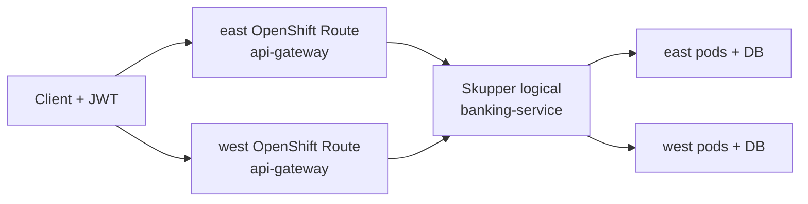

# Service Interconnect failover (OpenShift Routes)

Parallel demo path to [mesh failover](multi-cluster.md). It proves the banking API stays available when a regional cluster loses its **backend**, using:

| Layer | Product | Role |
| --- | --- | --- |
| Application network | **Red Hat Service Interconnect** (Skupper v2) | Logical `banking-service` across east/west; local preferred, remote on failure |
| Entry | **OpenShift Route** per cluster | `api-gateway` Route in `banking-si-apps` on east and on west |
| Visualization | **Service Interconnect Network Observer** | Console graph of sites, links, and traffic (Kiali analogue for this path) |

This stack is intentionally **isolated** from OpenShift Service Mesh ambient namespaces. There is **no** Connectivity Link / Route53 / shared global hostname on this path.

## Namespaces

| Namespace | Clusters | Contents |
| --- | --- | --- |
| `banking-si-apps` | east, west | api-gateway, banking-service, Skupper Site / Connector / Listener, Network Observer (west) |
| `banking-si-db` | east, west | Local PostgreSQL (no data HA — same constraint as the mesh demo) |

No `istio.io/dataplane-mode=ambient` labels on these namespaces.

## Architecture



- **OIDC** still comes from hub Keycloak (`banking-idp` / realm `banking`).
- Responses include `X-Banking-Cluster: east|west` when the image includes `ClusterIdentityFilter`.
- Data remains **per-cluster** PostgreSQL in `banking-si-db`.

## Prerequisites

1. Mesh demo (or at least hub Keycloak, Conjur/ESO, Quay images) already working.
2. RHSI + Network Observer operators (GitOps `platform-operators` on spokes).

## Bootstrap sequence

### 1. Sync GitOps

After operators install, Argo apps on east/west sync:

- `banking-si-postgresql` / `banking-si-service` / `banking-si-interconnect` / `banking-si-gateway`

### 2. Quay pull secret for SI apps

```bash
./scripts/sync-quay-pull-secret-to-clusters.sh
# syncs banking-apps and banking-si-apps by default
```

Both `api-gateway` and `banking-service` in `banking-si-apps` pull from Quay (`quay-pull`). SI ImageStreams keep `lookupPolicy.local: false` so OpenShift does not rewrite Quay tags to missing local tags after recover.

### 3. Link Skupper sites

West exposes `AccessGrant`; east redeems an `AccessToken`:

```bash
./scripts/si/link-sites.sh
./scripts/si/link-sites.sh status
```

### 4. Open the Network Observer console

```bash
./scripts/si/console-url.sh
./scripts/si/console-url.sh open   # macOS
```

The console lives on the **west** cluster (Route `banking-si-network-observer` in `banking-si-apps`). Log in with an OpenShift user for **west** (not ACM/Kiali).

That single Observer **is** the multi-cluster view: it aggregates the whole Service Interconnect application network (east + west). There is no separate hub console like ACM+Kiali; Topology / Components already span sites.

## Presenting the live demo

```bash
./scripts/demo-si-failover.sh           # interactive — press Enter between steps
```

### Network Observer — closest to a Kiali graph

Network Observer **2.x** sidebar: **Topology · Services · Sites · Components · Processes**  
(There is no **Addresses** menu — that name was retired; use **Services**.)

1. Open the URL from `./scripts/si/console-url.sh` (west).
2. Authenticate with west OpenShift credentials (`kube:admin` / west user).
3. **Topology → Sites** — two linked `banking-si` nodes (multi-site map).
4. **Topology → Components** (or left nav **Components**) → open **`banking-service`** — best live failover visual (processes per site + traffic). When east backend is drained, activity concentrates on west while clients still hit the **east** Route.
5. **Services** — application service / routing key `banking-service`.
6. **Processes** — optional pod-level drill-down.
7. Metrics scrape about every **15s**. Start traffic, then wait a few seconds.

Pair with the terminal cards: curl target URL, `★ EAST/WEST ★`, pretty customer JSON.

Optional third screen on **acm**: Perses **Banking failover compare** (`./scripts/perses-url.sh`) with namespace `banking-si-apps` — HTTP rate and ready replicas by `cluster=east|west` via hub promxy.

### What the terminal shows

Each sample prints a **request/response card**:

- `▶ REQUEST` — full `curl` against the OpenShift Route URL  
- `◀ RESPONSE` — HTTP status, `★ EAST/WEST ★` (serving cluster), pod counts, path story  
- customer list + pretty JSON body (preflight seeds Ada/Grace/Alan on **both** DBs)

Full dumps also go to `.demo-si-failover.log`. Shared with mesh via `scripts/lib/failover-demo.sh`.

### Step cheat sheet

| Step | Script action | Audience proof |
| --- | --- | --- |
| 1 | Open Network Observer | Topology: two linked sites |
| 2 | Baseline traffic via **east Route** | Graph/components warm up; HTTP 200 |
| 3 | Scale east `banking-service` → 0 | Still HTTP 200 via **east Route**; `east_svc=0`, `west_svc=1`; Observer shows cross-site flow |
| 4 | Scale east `api-gateway` → 0 | East Route fails; **west Route** stays HTTP 200 |
| 5 | Recover | Both replicas back; sites healthy |

Manual steps:

```bash
./scripts/demo-si-failover.sh preflight
./scripts/demo-si-failover.sh console
./scripts/demo-si-failover.sh fail-backend   # watch Observer
./scripts/demo-si-failover.sh fail-ingress   # east Route vs west Route
./scripts/demo-si-failover.sh recover
```

Contrast: mesh path uses ambient multi-network failover ([`demo-mesh-failover.sh`](../scripts/demo-mesh-failover.sh) + hub Kiali) with the same OpenShift Route entry pattern.

## GitOps layout

```text
gitops/
  platform/operators-spoke/   # skupper-operator, network-observer
  components/
    banking-si-postgresql/
    banking-si-service/overlays/{east,west}/
    banking-si-gateway/overlays/{east,west}/   # OpenShift Route
    banking-si-interconnect/overlays/{east,west}/   # Site, Connector, Listener; west: AccessGrant + NetworkObserver
  applications/{east,west}/banking-si-*.yaml
scripts/
  si/link-sites.sh
  si/console-url.sh
  demo-si-failover.sh
```

## Troubleshooting

| Symptom | Check |
| --- | --- |
| No `banking-service` Service | Listener Ready? `oc -n banking-si-apps get listener,connector,site` |
| SI failover does not flip cluster | Sites linked? `./scripts/si/link-sites.sh status` |
| Network Observer Route missing | CSV Succeeded for network-observer operator; NetworkObserver CR Ready |
| ImagePullBackOff on recover | SI `ImageStream` must keep `lookupPolicy.local: false` so Quay refs are not rewritten to a missing local tag. Recover also rewrites the Deployment back to Quay. Check `quay-pull` in `banking-si-apps`. |
| `serving=?` / no `X-Banking-Cluster` | Image lacks `ClusterIdentityFilter` or `BANKING_CLUSTER` unset; script may show `~west`/`~east` from pod counts |

## Related docs

- [Multi-cluster (mesh path)](multi-cluster.md)
- [Architecture](architecture.md)
- [Getting started](getting-started.md)
