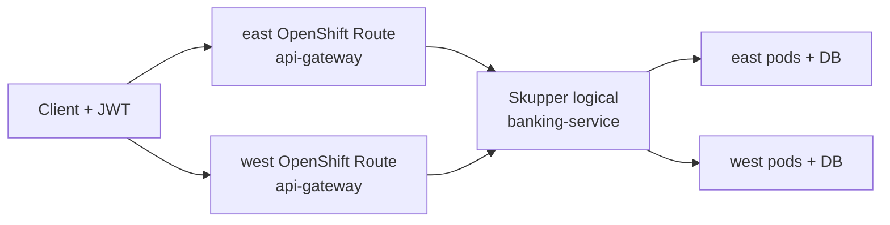

# Service Interconnect failover (OpenShift Routes)

Parallel demo path to [mesh failover](multi-cluster.md). It proves the banking API stays available when a regional cluster loses its **backend**, using:

| Layer | Product | Role |
| --- | --- | --- |
| Application network | **Red Hat Service Interconnect** (Skupper v2) | Logical `banking-service` across east/west; local preferred, remote on failure |
| Entry | **OpenShift Route** per cluster | `api-gateway` Route in `banking-si-apps` on east and on west |
| Visualization | **Service Interconnect Network Observer** | Console graph of sites, links, and traffic (Kiali analogue for this path) |

This stack is intentionally **isolated** from OpenShift Service Mesh ambient namespaces. There is **no** Connectivity Link / Route53 / shared global hostname on this path.

## Namespaces

| Namespace | Clusters | Contents |
| --- | --- | --- |
| `banking-si-apps` | east, west | api-gateway, banking-service, Skupper Site / Connector / Listener, Network Observer (west) |
| `banking-si-db` | east, west | Local PostgreSQL (no data HA — same constraint as the mesh demo) |

No `istio.io/dataplane-mode=ambient` labels on these namespaces.

## Architecture



- **OIDC** still comes from hub Keycloak (`banking-idp` / realm `banking`).
- Responses include `X-Banking-Cluster: east|west` when the image includes `ClusterIdentityFilter`.
- Data remains **per-cluster** PostgreSQL in `banking-si-db`.

## Prerequisites

1. Mesh demo (or at least hub Keycloak, Conjur/ESO, Quay images) already working.
2. RHSI + Network Observer operators (GitOps `platform-operators` on spokes).

## Bootstrap sequence

### 1. Sync GitOps

After operators install, Argo apps on east/west sync:

- `banking-si-postgresql` / `banking-si-service` / `banking-si-interconnect` / `banking-si-gateway`

### 2. Quay pull secret for SI apps

```bash
./scripts/sync-quay-pull-secret-to-clusters.sh
# syncs banking-apps and banking-si-apps by default
```

`api-gateway` reuses the per-cluster ImageStream in `banking-apps` (RoleBinding `banking-si-apps-image-puller`). `banking-service` pulls from Quay (or a local ImageStream after a binary build).

### 3. Link Skupper sites

West exposes `AccessGrant`; east redeems an `AccessToken`:

```bash
./scripts/si/link-sites.sh
./scripts/si/link-sites.sh status
```

### 4. Open the Network Observer console

```bash
./scripts/si/console-url.sh
./scripts/si/console-url.sh open   # macOS
```

The console lives on the **west** cluster (Route `banking-si-network-observer` in `banking-si-apps`). Log in with an OpenShift user for **west** (not ACM/Kiali).

## Presenting the live demo

```bash
./scripts/demo-si-failover.sh           # interactive — press Enter between steps
```

### Network Observer — what to click

1. Open the URL from `./scripts/si/console-url.sh` (west).
2. Authenticate with west OpenShift credentials.
3. **Topology** — two sites linked (`banking-si` east ↔ west).
4. **Sites** — both Ready, `sitesInNetwork=2`.
5. **Components / Addresses** — routing key `banking-service`.
6. Metrics scrape about every **15s**. Start traffic, then wait a few seconds before expecting graph activity.

Cross-site SI traffic is clearest when you drain east `banking-service`: east `api-gateway` still receives calls, Skupper forwards work to west pods.

### What the terminal status line means

| Field | Meaning |
| --- | --- |
| `HTTP` | API success (`200`) or failure |
| `svc=` | `X-Banking-Cluster` (`east`/`west`). `?` means the running image predates that filter |
| `east_svc` / `west_svc` | `banking-service` readyReplicas (SI proof) |
| `east_gw` / `west_gw` | `api-gateway` readyReplicas (ingress proof) |

Full request bodies go to `.demo-si-failover.log`, not the status line.

### Step cheat sheet

| Step | Script action | Audience proof |
| --- | --- | --- |
| 1 | Open Network Observer | Topology: two linked sites |
| 2 | Baseline traffic via **east Route** | Graph/components warm up; HTTP 200 |
| 3 | Scale east `banking-service` → 0 | Still HTTP 200 via **east Route**; `east_svc=0`, `west_svc=1`; Observer shows cross-site flow |
| 4 | Scale east `api-gateway` → 0 | East Route fails; **west Route** stays HTTP 200 |
| 5 | Recover | Both replicas back; sites healthy |

Manual steps:

```bash
./scripts/demo-si-failover.sh preflight
./scripts/demo-si-failover.sh console
./scripts/demo-si-failover.sh fail-backend   # watch Observer
./scripts/demo-si-failover.sh fail-ingress   # east Route vs west Route
./scripts/demo-si-failover.sh recover
```

Contrast: mesh path uses ambient multi-network failover ([`demo-mesh-failover.sh`](../scripts/demo-mesh-failover.sh) + hub Kiali) with the same OpenShift Route entry pattern.

## GitOps layout

```text
gitops/
  platform/operators-spoke/   # skupper-operator, network-observer
  components/
    banking-si-postgresql/
    banking-si-service/overlays/{east,west}/
    banking-si-gateway/overlays/{east,west}/   # OpenShift Route
    banking-si-interconnect/overlays/{east,west}/   # Site, Connector, Listener; west: AccessGrant + NetworkObserver
  applications/{east,west}/banking-si-*.yaml
scripts/
  si/link-sites.sh
  si/console-url.sh
  demo-si-failover.sh
```

## Troubleshooting

| Symptom | Check |
| --- | --- |
| No `banking-service` Service | Listener Ready? `oc -n banking-si-apps get listener,connector,site` |
| SI failover does not flip cluster | Sites linked? `./scripts/si/link-sites.sh status` |
| Network Observer Route missing | CSV Succeeded for network-observer operator; NetworkObserver CR Ready |
| ImagePullBackOff | Quay pull secret in `banking-si-apps` (and default dockercfg if using local ImageStream) |
| `svc=?` / no `X-Banking-Cluster` | Image lacks `ClusterIdentityFilter` or `BANKING_CLUSTER` unset |

## Related docs

- [Multi-cluster (mesh path)](multi-cluster.md)
- [Architecture](architecture.md)
- [Getting started](getting-started.md)
